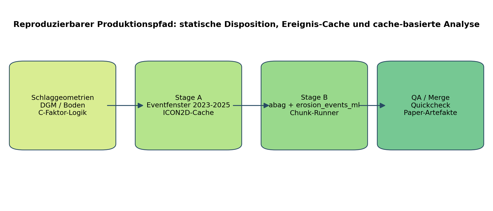
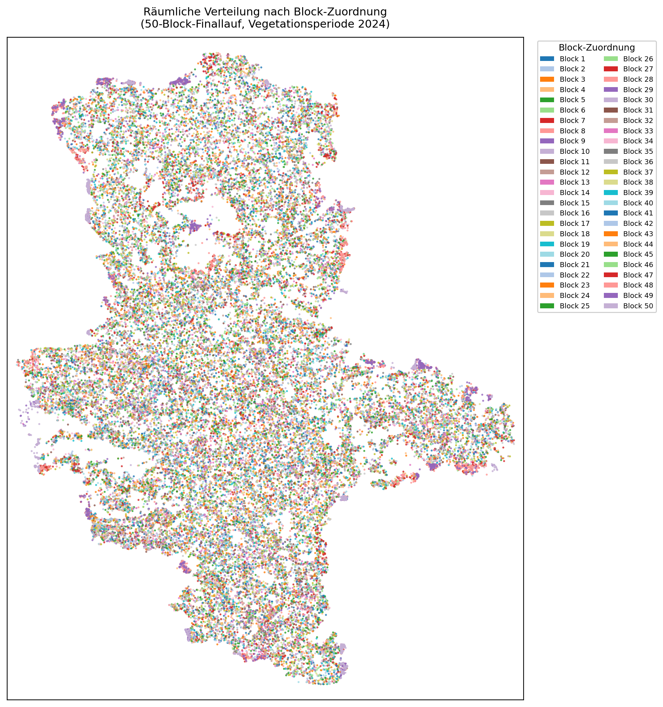
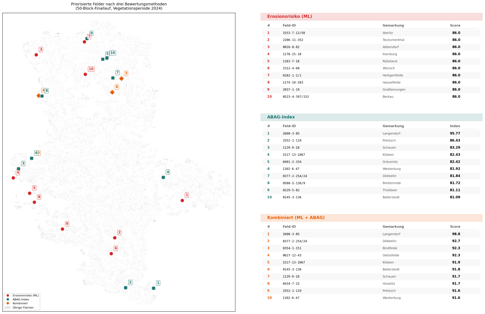

# Von langfristiger Erosionsdisposition zu ereignisbezogenem Schlagmonitoring in Sachsen-Anhalt

## Status
- Arbeitsmanuskript für ein deutschsprachiges Fachjournal
- Projektstand der eingearbeiteten Artefakte: `2026-03-12`
- Fokus: reproduzierbare Methodik, belastbarer Produktionspfad und fachliche Einordnung der derzeitigen Evidenz

## Titelvorschlag
Von langfristiger Erosionsdisposition zu ereignisbezogenem Schlagmonitoring in Sachsen-Anhalt

## Kurztitel
Ereignisbezogenes Erosionsmonitoring auf Schlagbasis in Sachsen-Anhalt

## Zusammenfassung
Die Beurteilung von Wassererosion auf landwirtschaftlichen Flächen beruht in Deutschland häufig auf langfristigen Risikomodellen wie ABAG beziehungsweise (R)USLE-abgeleiteten Größen. Diese sind für strategische Einordnungen unverzichtbar, lokalisieren einzelne erosionsrelevante Ereignisse jedoch nur eingeschränkt in Raum und Zeit. Das vorliegende Projekt adressiert diese Lücke mit einer reproduzierbaren Pipeline für Sachsen-Anhalt, die statische Disposition, dynamische Ereignisfenster und ereignisbezogene Modellinferenz auf Schlagbasis zusammenführt. Die Problemstellung steht damit im Kontext der anhaltenden Diskussion über Reichweite und Grenzen etablierter Erosionsmodellierung sowie über den Bedarf an zeitlich differenzierteren Monitoringansätzen (Panagos et al., 2015; Alewell et al., 2019; Parsons, 2019).

Die Pipeline kombiniert drei Bausteine: erstens ABAG-orientierte Dispositionsgrößen aus Topographie, Boden und C/P-Annahmen, zweitens automatisch ermittelte Wetterereignisse je Schlag und Vegetationsfenster, drittens eine ereignisbezogene Auswertung in den Modi `abag` und `erosion_events_ml`. Der produktive Ablauf ist in zwei Stufen getrennt. In Stufe A werden Ereignisfenster für die Vegetationsperioden 2023, 2024 und 2025 landesweit vorab berechnet und lokal gecacht. In Stufe B werden die eigentlichen Analysen ausschließlich aus diesem Cache reproduzierbar, blockbasiert und wiederaufnahmefähig ausgeführt.

Methodisch orientiert sich der Ansatz an aktuellen Arbeiten zum dynamischen Erosionsmonitoring, übernimmt deren Grundidee aber nicht unverändert. Die Arbeit von Batista et al. (2025) zeigt, dass ereignisbezogene Erosionsereignisse auf Ackerschlägen mit maschinellem Lernen grundsätzlich räumlich und zeitlich nowcastbar sind. Das vorliegende Projekt verfolgt dagegen einen operativen, app-integrierten Produktionspfad für die landesweite Skalierung und berichtet die Grenzen explizit: Die aktuell verwendeten Ereignisfenster sind meteorologisch getrieben und stellen keine unabhängigen Erosionsbeobachtungslabels dar. Die Arbeit von Steinhoff-Knopp et al. (2025) zu raumzeitlich detaillierten C-Faktor-Karten stützt zugleich die Entscheidung, die C-Faktor-Methodik versioniert, mehrjährig und perspektivisch fruchtfolgebasiert aufzubauen.

Der derzeitige Beitrag liegt daher weniger in einer abschließenden kausalen Leistungsbewertung als in einer belastbaren, auditierbaren Produktions- und Auswertungsarchitektur für ereignisbezogenes Schlagmonitoring. Der abgeschlossene 50-Block-Finallauf für das Vegetationsfenster 2024 zeigt, dass diese Architektur auch unter landesweiter Skalierung belastbar arbeitet. Die Ergebnisse sind für Vorprüfung, Priorisierung und spätere Szenarienvergleiche unmittelbar nutzbar; finale vergleichende Modellmetriken und Ablationen bleiben einer gesonderten Auswertungsstufe vorbehalten.

## Schlüsselwörter
- Wassererosion
- Schlagmonitoring
- Ereignisfenster
- ABAG
- C-Faktor
- Fernerkundung
- Reproduzierbarkeit

## 1. Einleitung
Wassererosion auf Ackerflächen ist für Bodenfunktionen, Gewässer und landwirtschaftliche Produktivität weiterhin ein relevantes Umweltproblem. Für die fachliche Einordnung stehen seit langem etablierte Modelle zur Verfügung, die langfristige Erosionsdisposition beschreiben. Solche Ansätze sind für Priorisierung und Planung unverzichtbar, bilden jedoch die starke raumzeitliche Variabilität einzelner Erosionsereignisse nur begrenzt ab. Diese Spannung zwischen strategischer Langfristbewertung und operativem Ereignisbezug ist in der neueren Literatur mehrfach hervorgehoben worden (Alewell et al., 2019; Eekhout und de Vente, 2020; Panagos et al., 2021).

Gerade für operative Anwendungen entsteht daraus eine methodische Lücke. In der Praxis wird nicht nur gefragt, welche Flächen grundsätzlich gefährdet sind, sondern auch, wann innerhalb einer Saison konkrete Wetterlagen auf einzelnen Schlägen erosionsrelevant werden können. Ein belastbares Monitoring muss deshalb zwischen langfristiger Disposition und ereignisbezogener Exposition vermitteln.

Dieses Projekt setzt an dieser Schnittstelle an. Ziel ist kein Ersatz etablierter Erosionsmodelle und auch keine vollständige Kausalerklärung jedes beobachteten Schadensfalls. Untersucht wird vielmehr, ob sich auf Basis vorhandener Geodaten, wettergetriebener Ereignisfenster und einer reproduzierbaren Analysepipeline ein fachlich plausibles, skalierbares Schlagmonitoring für Sachsen-Anhalt aufbauen lässt.

## 2. Zielstellung
Die Leitfrage des Projekts lautet:

Kann eine reproduzierbare, landesweit skalierbare Pipeline langfristige Erosionsdisposition und ereignisbezogene Wetterauslöser so zusammenführen, dass für einzelne Schläge belastbare Monitoring- und Priorisierungshinweise entstehen?

Daraus ergeben sich vier konkrete Ziele:

1. Aufbau eines wiederaufnahmefähigen Produktionspfads für Schlag x Ereignis x Modus.
2. Trennung von Ereignisvorberechnung und Modellinferenz, damit große Läufe robust und auditierbar bleiben.
3. Methodisch saubere Einordnung der C-Faktor- und Ereignislogik im Anschluss an aktuelle Fachliteratur.
4. Erzeugung zitierfähiger Artefakte für QA, Karten, Top-Listen und spätere Szenarioanalysen.

## 3. Stand der Fachliteratur und Einordnung
Zwei aktuelle Arbeiten sind für die Einordnung des Projekts zentral; ergänzend sind neuere Beiträge zu Modellgrenzen, C-Faktor-Ableitung und europaweiten Risikoprojektionen relevant.

Die Arbeit von Batista et al. (2025) zum ereignisbezogenen Erosions-Nowcasting auf Ackerflächen zeigt, dass maschinelles Lernen erosionsrelevante Ereignisse auf regionaler Ebene in Raum und Zeit differenziert abbilden kann. Methodisch ist dies für das vorliegende Projekt wichtig, weil es die Grundidee einer dynamischen, ereignisbezogenen Bewertung stärkt. Dieses Projekt folgt diesem Ansatz jedoch nicht direkt: Es nutzt keinen identischen Trainingsaufbau mit unabhängigen, manuell oder extern bestätigten Erosionslabels, sondern einen produktionsnahen, app-integrierten Workflow mit meteorologisch abgeleiteten Ereignisfenstern.

Die Arbeit von Steinhoff-Knopp et al. (2025) zu raumzeitlich detaillierten C-Faktor-Karten für Deutschland unterstreicht, dass Erosionsmodellierung wesentlich von mehrjähriger, hochaufgelöster Information zu Bewuchs- und Bewirtschaftungsfolgen profitiert. Diese Aussage stützt die in diesem Projekt bereits umgesetzte Methodik, den C-Faktor versioniert zu berechnen, Mehrjahresfenster explizit zu führen und einen Upgradepfad über offene Fruchtfolgedaten vorzuhalten. Das Projekt übernimmt damit nicht nur einen technischen Input, sondern auch die methodische Konsequenz, C nicht als statische Hilfsgröße zu behandeln.

Darüber hinaus ist für die methodische Einordnung wichtig, dass die europaweite Literatur sowohl das breite Einsatzspektrum von (R)USLE-basierten Ansätzen als auch deren Grenzen im Umgang mit Prozessdynamik, Skalenübertragungen und Klimaprojektionen betont (Panagos et al., 2015; Alewell et al., 2019; Eekhout und de Vente, 2020). Feldparcel-orientierte C-Faktor-Ansätze zeigen zugleich, dass eine zeitlich verteilte und flächenbezogene Sicht für operationale Anwendungen sinnvoll ist (Matthews et al., 2023).

Der hier verfolgte Ansatz ist somit weder eine reine ABAG-Anwendung noch eine direkte Replik des Batista-Ansatzes. Er bildet eine Brücke zwischen langfristiger Disposition, dynamischer Exposition und operativer Ausführbarkeit auf Landesebene.

## 4. Untersuchungsraum und Datengrundlage
### 4.1 Untersuchungsraum
Untersuchungsraum ist Sachsen-Anhalt. Die Verarbeitung erfolgt auf Schlagbasis mit einem landesweiten Schlagbestand in lokaler SQLite-Cache-Struktur. Für Produktionsläufe wird dieser Bestand in feste Blöcke zerlegt, um Laufstabilität, Kontrollpunkte und Wiederaufnahme sicherzustellen.

### 4.2 Schlaggeometrien
Die Grundgesamtheit liegt in `data/raw/sa_flurstuecke/cache/flurstuecke.sqlite`. Für publikationsnahe Teilmengen steht zusätzlich ein räumlich stratifizierter Stichproben-Pfad zur Verfügung, um Karten und Auswertungen nicht von der `rowid`-Reihenfolge abhängig zu machen.

### 4.3 Terrain- und Dispositionsdaten
Die statische Disposition wird über ABAG-orientierte Größen aus Topographie, Boden und Faktorenlogik beschrieben. Das Relief wird produktiv über lokale COG-basierte DGM-Daten eingebunden (`dem_source=cog`). Auf dieser Grundlage werden unter anderem ABAG-Metriken und zugehörige Komponenten für die ereignisbezogene Bewertung bereitgestellt.

### 4.4 C-Faktor-Methodik
Die C-Faktor-Methodik ist versioniert und in JSON-Konfigurationen formalisiert (`data/config/c_factor_method_v1*.json`). Der Hauptpfad nutzt die parallel entwickelte konfidenzgesteuerte Kulturartenklassifikation CT-NOW (siehe Abschnitt 8.3), die für 97 % der Schläge feldspezifische C-Faktoren aus sieben agronomischen Klassen ableitet. Für Felder unterhalb der Konfidenzschwelle oder ohne Klassifikationsergebnis greift ein statischer Proxy-Raster als Rückfallebene, der `C_base` aus Feldblockklassen ableitet und über NDVI-basierte Fensterinformationen modifiziert.

Diese Ausrichtung folgt der Erkenntnis von Steinhoff-Knopp et al. (2025), dass Erosionsmodellierung wesentlich von mehrjähriger, hochaufgelöster Kulturarteninformation profitiert. Die zweistufige C-Faktor-Logik (CT-NOW als Hauptpfad, Proxy als Rückfallebene) stellt sicher, dass feldspezifische Informationen genutzt werden wo sie mit ausreichender Konfidenz vorliegen, ohne auf den übrigen Flächen eine Bewertung auszuschließen.

### 4.5 Ereignisfenster
Ereignisfenster werden automatisch pro Schlag über den Backend-Endpunkt `/abflussatlas/weather/events` abgeleitet. Produktiv ist `ICON2D` als Standardquelle gesetzt. Verbindliche Fenster der vorab berechneten Ereignisbasis sind:

1. `2023-04-01` bis `2023-10-31`
2. `2024-04-01` bis `2024-10-31`
3. `2025-04-01` bis `2025-10-31`

Stufe A liegt vollständig für die Vegetationsfenster 2023, 2024 und 2025 vor. Der in diesem Manuskript ausgewertete Finallauf von Stufe B nutzt daraus das Fenster `2024-04-01` bis `2024-10-31` mit `top_n=5` und `min_severity=0`. Null-Ereignis-Fälle werden als regulärer Ergebnisfall behandelt und nicht als technischer Fehler interpretiert.

## 5. Methodik
### 5.1 Grundlogik der Modellierung
Die Modellierung verbindet statische und dynamische Komponenten:

1. Statische Disposition über ABAG-orientierte Größen.
2. Dynamische Exposition über vegetationsperiodische Fenster und C-bezogene Proxys.
3. Ereignisauslöser über automatisch ermittelte Wetterfenster.
4. Ereignisbezogene Auswertung pro Schlag und Event in zwei Modi:
   - `abag`: Berechnung des langfristigen Erosionsindex nach ABAG (K × R × L × S × C × P) auf Basis der statischen Dispositionsfaktoren und des feldspezifischen C-Faktors.
   - `erosion_events_ml`: Ein Random-Forest-Klassifikator, der pro Feld und Ereignis eine kalibrierte Erosionswahrscheinlichkeit vorhersagt. Das Modell nutzt topographische Merkmale (Hangneigung, Einzugsgebietsgröße, Fließweglänge), Bodeneigenschaften und ereignisspezifische Niederschlagskenngrößen als Eingangsvariablen.

Das Ergebnis ist eine einheitliche Tabelle auf der Achse Schlag × Ereignis × Modus.

Abbildung 1 fasst den technischen Produktionspfad des Projekts zusammen.

### 5.2 Stufe-A/Stufe-B-Architektur
Der produktive Ablauf ist in zwei Stufen getrennt.

Stufe A berechnet die Ereignisfenster landesweit vor und speichert sie in einem lokalen Zell-Cache. Dieser Schritt ist für die Vegetationsperioden 2023, 2024 und 2025 bereits vollständig durchgeführt. Die Trennung ist methodisch wichtig, weil wetterseitige Drosselung- oder Providerprobleme dadurch aus der eigentlichen Modellphase herausgezogen werden.

Stufe B führt die Analysen `erosion_events_ml` und `abag` ausschließlich aus dem lokalen Ereignis-Cache aus. Die Verarbeitung erfolgt blockbasiert, wiederaufnahmefähig, mit Kontrollpunkten, QA-Dateien, Laufzustandsdateien und Manifesten. Damit ist sichergestellt, dass Unterbrechungen, Neustarts und spätere Audits ohne stillen Datenverlust oder methodische Vermischung nachvollziehbar bleiben.

### 5.3 Blockbildung, Wiederaufnahme und Qualitätssicherung
Die landesweite Verarbeitung nutzt standardmäßig Blöcke von 1.000 Flächen. Relevante Robustheitsmerkmale sind:

1. partielle CSV-Schreibungen in festen Intervallen,
2. `.done`-Marker und QA-Berichte je Block,
3. zentraler `sa_chunk_run_state.json`,
4. Run-Manifeste mit Zeitstempel,
5. Zusammenführungs- und Schnellprüfungspfade für die Paper-Artefakte.

Diese Architektur ist kein rein technisches Detail, sondern Teil der wissenschaftlichen Nachvollziehbarkeit. Gerade bei großen landesweiten Läufen muss transparent bleiben, welche Blöcke erfolgreich, fehlerhaft oder noch offen sind.

### 5.4 Fachliche Filter und Betriebsregeln
Um numerisch oder fachlich ungeeignete Flächen auszuschließen, werden Geometrieprüfung (Validität, Mindestfläche 0,05 ha) und optionale fachliche Filterlisten eingesetzt.

### 5.5 Ausblick: Ablationen und Sensitivitäten
Weiterführende Ablationen über C-Varianten (Proxy vs. CT-NOW vs. Fruchtfolge-Sequenz), Dispositionsstufen und Sensitivitäten der C-Methodik sind auf der vorliegenden Exportbasis vorbereitet und werden in einer nachgelagerten Auswertung berichtet.

## 6. Aktueller Produktionsstand
Der methodische Kernpfad ist inzwischen stabilisiert. Stufe A ist für alle drei Vegetationsfenster 2023, 2024 und 2025 abgeschlossen. Der hier berichtete Stufe-B-Finallauf nutzt den lokalen Ereignis-Cache für das Fenster `2024-04-01` bis `2024-10-31` und umfasst einen vollständigen 50-Block-Umfang mit zwei Analysemodi.

Im Gegensatz zu einem früheren Vorlauf, der aufgrund von `rowid`-basierter Block-Sortierung eine räumliche Konzentration im Südwesten Sachsen-Anhalts aufwies, basiert der vorliegende Finallauf auf einem räumlich stratifizierten Sample von 50.000 Ackerflächen. Die Stichprobe wurde so gezogen, dass alle Landkreise proportional zu ihrer Ackerfläche vertreten sind und die räumliche Verteilung landesweit repräsentativ ist.

Für diesen Finallauf liegen Ergebnisse für alle 50 Blöcke vor. Nach Zusammenführung und Gesamt-QA umfasst der Datensatz 263.378 Zeilen, davon 262.875 mit Status „ok" und 503 mit Status „error". Die berechnete Fehlerquote liegt bei 0,19 %. Im zusammengeführten Bestand entfallen jeweils 131.689 Zeilen auf `erosion_events_ml` und `abag` — die symmetrische Aufteilung bestätigt die korrekte parallele Ausführung beider Modi für jeden Schlag-Ereignis-Fall. Der Datensatz umfasst 48.037 eindeutige Feldidentifikatoren.

Die Blockgrößen variieren zwischen 4.684 und 5.644 Zeilen (Median ca. 5.300), was auf eine gleichmäßige Verteilung der Ereignisdichte über die Stichprobe hinweist. Die Laufzeit des Finallaufs wurde durch parallele 2-Arbeitsprozess-Verarbeitung mit automatischem Wiederaufnahme und Kontrollpunktmechanismus auf wenige Tage begrenzt. Die Projekterfahrung zeigt, dass Laufzeit nicht allein von der Blockzahl abhängt, sondern vor allem von Ereignisdichte, Geometriekomplexität, AOI-Größe und I/O-Verhalten.

## 7. Ergebnisse und derzeit belastbare Aussagen
Auf dem nun vorliegenden 50-Block-Endstand mit 263.378 Ergebniszeilen über 48.037 räumlich repräsentativ verteilte Ackerflächen liegt eine belastbare empirische Basis vor. Die nachfolgenden Abbildungen 2 bis 4 basieren auf dem final gemergten, räumlich stratifizierten 50-Block-Lauf (`paper/exports/sa_chunks_icon2d_3y_spatial_filtered_50k/field_event_results_ALL_50chunks.csv`) sowie den daraus erzeugten Paper-Assets.

Erstens ist der zweistufige Produktionspfad mit vorab berechnetem Ereignis-Cache dem direkten Echtzeitabruf in großen Läufen klar überlegen, weil Providergrenzen und 429-artige Störungen nicht mehr still als echte Null-Ereignisse in die Modellierung eingehen.

Zweitens ist die Trennung von Stufe A und Stufe B fachlich sinnvoll, weil Wetterereignisse inzwischen für ganz Sachsen-Anhalt und für die Jahre 2023 bis 2025 systematisch vorliegen und bereits an die Felder gekoppelt sind. Dadurch wird die eigentliche Modellphase reproduzierbar, neustartfähig und für QA deutlich sauberer.

Drittens liegt mit den Modi `abag` und `erosion_events_ml` bereits eine belastbare Brücke zwischen langfristiger Disposition und ereignisbezogener Bewertung vor. Diese Brücke ist für Priorisierung, Kartenprodukte, Top-Listen und spätere Maßnahmenszenarien unmittelbar nutzbar.

Abbildung 2 zeigt die Verteilungen zentraler Größen im finalen 50-Block-Lauf. Sichtbar wird dabei, dass die Pipeline nicht nur Ereigniswahrscheinlichkeiten, sondern zugleich langfristige Dispositionsinformationen und einen zusammengesetzten Risikoscore bereitstellt.

Abbildung 3 zeigt die räumliche Verteilung der im finalen 50-Block-Lauf verarbeiteten Flächen nach Block-Zuordnung. Die Karte dient nicht der fachlichen Interpretation einzelner Risikowerte, sondern der transparenten Dokumentation der räumlichen Abdeckung des ausgewerteten Bestands.

Abbildung 4 zeigt die priorisierten Top-10-Felder im räumlichen Kontext des finalen 50-Block-Laufs. Dadurch wird der Schnellprüfungspfad als kartierbare Entscheidungsausgabe auf dem Zusammenführungsstand sichtbar.

Noch nicht belastbar berichtet werden sollten hingegen finale Klassifikationsmetriken, globale Vergleichstabellen und inferenzielle Aussagen zur Überlegenheit einzelner Modellvarianten. Diese Punkte gehören in eine nachgelagerte Ablations- und Validierungsphase mit unabhängigerer Referenzbasis.

### 7.2 C-Faktor-Vergleich: Proxy-C vs. CT-NOW-C

Die Integration feldspezifischer C-Faktoren über CT-NOW ermöglicht einen direkten Vergleich mit dem bisher verwendeten statischen Proxy-Raster (C = 0,15). Für 27.571 Felder mit CT-NOW-Klassifikation bei Konfidenz >= 0,40 wurde der ABAG-Index per Verhältniskorrektur (C_neu / C_alt) aktualisiert.

Der Median des ABAG-Index sinkt von 0,12 (Proxy-C) auf 0,06 (CT-NOW-C). Die Verschiebung geht im Wesentlichen auf Grünlandflächen zurück (30 % der klassifizierten Felder), deren tatsächlicher C-Faktor (0,004) weit unter dem Proxy-Durchschnitt (0,15) liegt — für diese Flächen überschätzt der Proxy das Erosionsrisiko systematisch. Umgekehrt steigen die ABAG-Werte für Mais- und Hackfruchtflächen, deren kulturartenspezifische C-Faktoren (0,34–0,40) über dem Proxy liegen. In der Praxis bedeutet das: Ohne feldspezifische Kulturarteninformation werden Grünlandflächen fälschlich als erosionsgefährdet eingestuft, während das tatsächliche Risiko auf Maisflächen unterschätzt wird.

Abbildung 5 zeigt den Vergleich in drei Perspektiven: (A) die Verteilungsverschiebung der ABAG-Mittelwerte, (B) die feldspezifische Veränderung nach Kulturart und (C) die resultierende ABAG-Differenzierung über die sieben CT-NOW-Klassen.

Der Vergleich zeigt, dass der statische C-Proxy das Erosionsrisiko für Grünlandflächen systematisch überschätzt und für Mais- und Hackfruchtflächen unterschätzt. Die CT-NOW-basierte Korrektur erzeugt eine fachlich plausiblere Risikodifferenzierung, bei der die bekannte Kulturartenabhängigkeit der Erosionsgefährdung (DIN 19708) auf Feldebene sichtbar wird.

Einschränkend ist zu bemerken, dass die CT-NOW-Klassifikation für Sachsen-Anhalt mit einer medianen Konfidenz von 0,44 arbeitet, was teilweise auf die jahresübergreifende Anwendung (Modell 2021, Daten 2024) und das Fehlen von Sentinel-1-Merkmalen in der Inferenz zurückzuführen ist. Insbesondere der Hackfrucht-Anteil von 24 % erscheint für Sachsen-Anhalt leicht erhöht und könnte auf Verwechslungen mit Sommergetreide hinweisen. Für die operative Anwendung wird daher empfohlen, die Konfidenz-Schwelle bei mindestens 0,60 zu setzen und Felder unterhalb dieser Schwelle weiterhin mit dem Proxy-C zu bewerten.

## 8. Diskussion
### 8.1 Fachliche Bedeutung
Das Projekt zeigt, dass der Übergang von langfristiger Risikobewertung zu ereignisbezogenem Schlagmonitoring technisch und methodisch konsistent organisierbar ist. Der Hauptbeitrag liegt nicht in einem einzelnen Modellwert, sondern in einer belastbaren Architektur, die landesweite Ausführung, Neustartsicherheit, QA und spätere Berichtsartefakte zusammenhält.

### 8.2 Einordnung gegenüber dem Ansatz von Batista et al.
Die Arbeit von Batista et al. (2025) ist für dieses Projekt ein wichtiger Referenzpunkt, weil sie die wissenschaftliche Plausibilität eines dynamischen Erosionsmonitorings mit maschinellem Lernen stärkt. Gleichzeitig muss klar bleiben, dass das vorliegende Projekt derzeit einen anderen Evidenztyp liefert. Die aktuelle Pipeline ist produktionsnah, skalierbar und auf operative Reproduzierbarkeit optimiert; sie ist keine direkte Replik eines labelbasierten Ereignis-Nowcasting-Setups mit unabhängiger Erosionsbeobachtung als Referenzstandard.

### 8.3 Einordnung der C-Faktor-Methodik
Die Arbeit von Steinhoff-Knopp et al. (2025) macht deutlich, dass C-Faktoren mit einjährigen oder zu groben Informationen systematisch an Aussagekraft verlieren können. Diese Einsicht bestätigt die Entscheidung, den C-Faktor in diesem Projekt als versionierte, explizit weiterentwickelbare Methodik zu führen. Die laufende Integration offener Fruchtfolgedaten ist deshalb kein Zusatzdetail, sondern fachlich ein zentraler Ausbaupfad. Auch feldparcel-orientierte C-Faktor-Arbeiten auf europäischer Ebene stützen diese Richtung (Matthews et al., 2023).

Parallel zu diesem Projekt wurde das In-Season-Klassifikationsmodell CT-NOW entwickelt, das auf Basis offener Schlagdaten (NRW-Fruchtfolgen, EuroCrops, Thünen CTM) und Sentinel-1/2-Zeitreihen Kulturarten auf Schlagebene klassifiziert. Das Modell nutzt einen isotonisch kalibrierten HistGradientBoostingClassifier mit 144 Merkmalen (120 optische S2 + 24 S1-Radar) über 12 Beobachtungszeitpunkte und wurde auf 49.497 Trainingsfeldern aus 12 deutschen Bundesländern validiert.

Der entscheidende methodische Hebel ist die agronomisch motivierte Klassenzusammenfassung. Während das detaillierte 13-Klassen-Modell bei Konfidenz >= 0,80 nur 51 % Abdeckung erreicht, löst die Reduktion auf 7 C-Faktor-relevante Klassen (Wintergetreide, Sommergetreide, Winterraps, Mais, Grünland, Hackfrüchte, Brache) das Abdeckungsproblem vollständig: **90,5 % Genauigkeit bei 97 % Abdeckung** (@conf >= 0,60). Die spektrale Mehrdeutigkeit innerhalb der zusammengefassten Gruppen (z.B. Winterweizen vs. Wintergerste) wird irrelevant, da diese Kulturen nahezu identische C-Faktoren aufweisen.

Für die Erosionsmodellierung ist dies unmittelbar nutzbar, weil die 7 Klassen exakt die relevanten C-Faktor-Gruppen abdecken:

| CT-NOW-Klasse | C-Faktor (DIN 19708) |
|---|---|
| Grünland | 0,01–0,04 |
| Wintergetreide | 0,08–0,12 |
| Winterraps | 0,15–0,25 |
| Sommergetreide | 0,15–0,20 |
| Hackfrüchte (Kartoffel, Zuckerrübe) | 0,25–0,40 |
| Mais | 0,30–0,45 |
| Brache | 0,01–0,05 |

Damit lässt sich für 97 % aller Schläge ein feldspezifischer C-Faktor ableiten, der den bisher verwendeten statischen C-Proxy-Raster substantiell ergänzt. Im Per-Klassen-Vergleich übertrifft CT-NOW bei Konfidenz >= 0,70 die Thünen-Referenz (CTM 2021, OA = 84,0 %) in 10 von 12 Kulturarten. Da die ABAG-Ergebnisse als Gesamtindex vorliegen, lässt sich ein aktualisierter C-Faktor per Verhältniskorrektur (C_neu / C_alt) ohne vollständigen Neuberechnungslauf integrieren.

CT-NOW ist damit kein zukünftiger Ausbaupfad mehr, sondern ein operativ verfügbarer Baustein für feldspezifische Erosionsbewertung.

## 9. Grenzen
Die derzeitige Evidenz unterliegt mehreren klaren Einschränkungen:

1. Die Ereignisfenster sind meteorologisch abgeleitet und keine direkten Erosionsbeobachtungslabels.
2. Finale Ablationen und Vergleichsmetriken liegen auf der vorliegenden Exportbasis noch nicht vollständig vor.
3. Ein kleiner Anteil von 0,19 % Fehlerzeilen im Finallauf zeigt, dass auch im stabilisierten Produktionspfad numerische oder geometrische Sonderfälle verbleiben, wobei die Quote gegenüber früheren Läufen deutlich gesenkt werden konnte.
4. Aussagen zur kausalen Erosionsintensität müssen später mit unabhängigeren Referenzen weiter abgesichert werden.

## 10. Praktischer Nutzen
Bereits im aktuellen Stand ist der Ansatz für drei Einsatzfelder sinnvoll:

1. Vorprüfung und Priorisierung gefährdeter Flächen,
2. kartengestützte Nachvollziehbarkeit für Fachbehörden und Projektpartner,
3. Vorbereitung von Maßnahmen- und Szenarioläufen auf Basis kombinierter Risiko- und Ereignisinformation.

Die ArcEGMO-nahe Weiterentwicklung ist dabei bereits angelegt. Aus den bestehenden Ergebnissen lassen sich priorisierte Flächen, Kartenlayer und spätere Vorher-Nachher-Szenarien über C- und P-Varianten ableiten.

4. Feldspezifische C-Faktor-Verbesserung über CT-NOW-Integration: Die 7-Klassen-Klassifikation mit 90,5 % Genauigkeit bei 97 % Abdeckung ermöglicht für nahezu jeden Schlag in Sachsen-Anhalt eine kulturartenspezifische C-Faktor-Ableitung anstelle des bisherigen statischen Proxy-Rasters.

## 11. Schlussfolgerung
Das Projekt etabliert für Sachsen-Anhalt eine reproduzierbare Brücke zwischen langfristiger Erosionsdisposition und ereignisbezogenem Schlagmonitoring. Der belastbarste derzeitige Beitrag ist eine produktionsfeste, auditierbare Pipeline mit sauber getrennter Ereignisvorberechnung, cache-basierter Modellphase und systematischen QA-Artefakten.

Wissenschaftlich ist der Ansatz damit bereits als methodischer und infrastruktureller Beitrag tragfähig. Mit der Integration von CT-NOW steht zudem ein validierter Pfad zur feldspezifischen C-Faktor-Ableitung bereit, der den statischen Proxy-Raster für 97 % der Schläge durch kulturartenbasierte Werte ersetzt. Die abschließende Bewertung der Modellgüte gegenüber Alternativen folgt in einer nachgelagerten Ablations- und Validierungsstufe auf Basis des nun vollständig gemergten und qualitätsgesicherten Exportstands.

## 12. Reproduzierbarkeit
Der vollständige Quellcode der Pipeline, die Konfigurationsdateien, die Render-Skripte für alle Abbildungen sowie der zusammengeführte Ergebnisdatensatz (263.378 Zeilen) sind im Projektrepository hinterlegt. Die Verarbeitung ist über dokumentierte Laufprotokolle und Kontrollpunkte je Block nachvollziehbar.

## 13. Literatur
Alewell, C., Borrelli, P., Meusburger, K., Panagos, P. (2019): Using the USLE: Chances, challenges and limitations of soil erosion modelling. *International Soil and Water Conservation Research* 7(3), 203-225. https://doi.org/10.1016/j.iswcr.2019.05.004

Batista, P. V. G., Möller, M., Schmidt, K., Waldau, T., Seufferheld, K., Htitiou, A., Golla, B., Ebertseder, F., Auerswald, K., Fiener, P. (2025): Soil-erosion events on arable land are nowcast by machine learning. *CATENA* 251, 109080. https://doi.org/10.1016/j.catena.2025.109080

Eekhout, J. P. C., de Vente, J. (2020): How soil erosion model conceptualization affects soil loss projections under climate change. *Progress in Physical Geography: Earth and Environment* 44(2), 212-232. https://doi.org/10.1177/0309133319871937

Matthews, F., Verstraeten, G., Borrelli, P., Panagos, P. (2023): A field parcel-oriented approach to evaluate the crop cover-management factor and time-distributed erosion risk in Europe. *International Soil and Water Conservation Research* 11(4), 558-573. https://doi.org/10.1016/j.iswcr.2022.09.005

Panagos, P., Borrelli, P., Poesen, J., Ballabio, C., Lugato, E., Meusburger, K., Montanarella, L., Alewell, C. (2015): The new assessment of soil loss by water erosion in Europe. *Environmental Science & Policy* 54, 438-447. https://doi.org/10.1016/j.envsci.2015.08.012

Panagos, P., Ballabio, C., Himics, M., Scarpa, S., Matthews, F., Bogonos, M., Borrelli, P. (2021): Projections of soil loss by water erosion in Europe by 2050. *Environmental Science & Policy* 124, 380-392. https://doi.org/10.1016/j.envsci.2021.07.012

Parsons, A. J. (2019): How reliable are our methods for estimating soil erosion by water? *Science of the Total Environment* 676, 215-221. https://doi.org/10.1016/j.scitotenv.2019.04.307

Steinhoff-Knopp, B., Neuenfeldt, S., Erasmi, S., Saggau, P. (2025): Spatiotemporal detailed crop cover and management factor maps as agri-environmental indicators for soil erosion in Germany. *International Soil and Water Conservation Research*. https://doi.org/10.1016/j.iswcr.2025.06.002
